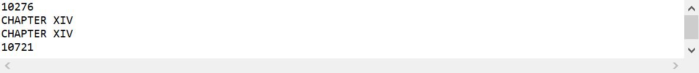
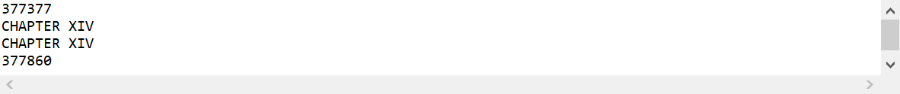
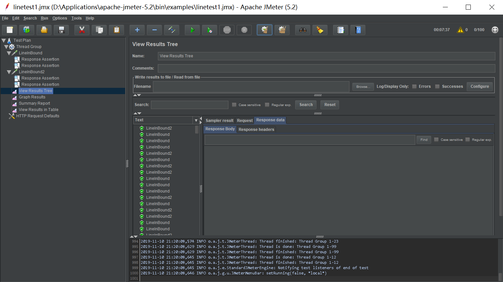
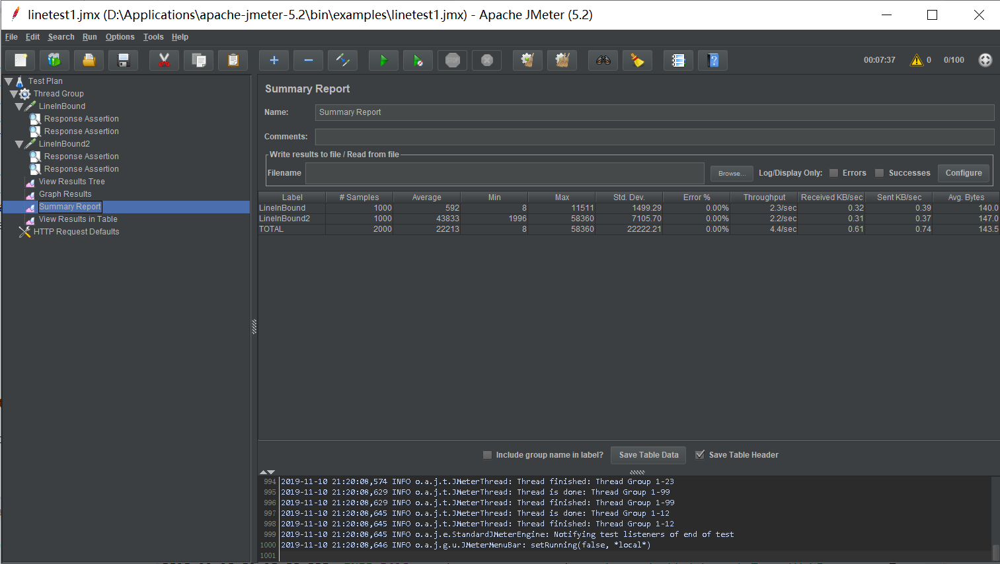
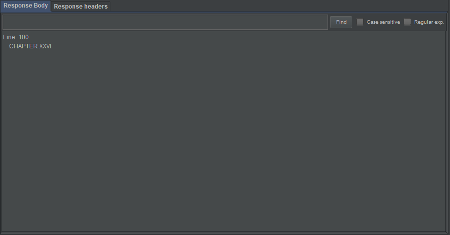
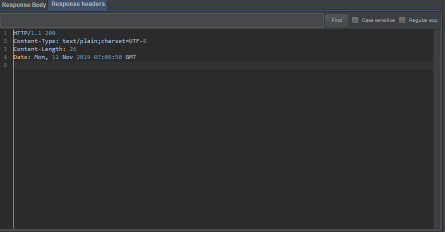

# Line Read Server
## Description
In this exercise, you will build and document a system that is capable of serving lines out of a file to network clients. You may do this in any language (although Ruby, Java, JavaScript, or Scala are preferred). You may use any reference and any open-source software you can find to help you build this system, so long as you document your use. However, you should not actively collaborate with others.
Your system should act as a network server that serves individual lines of an immutable text file over the network to clients using the following simple REST API:

* `GET /lines/<line index>` . 
  * Returns an HTTP status of 200 and the text of the requested line or an HTTP 413 status if the requested line is beyond the end of the file.  

Your server should support multiple simultaneous clients.
The system should perform well for small and large files.
The system should perform well as the number of GET requests per unit time increases.
You may pre-process the text file in any way that you wish so long as the server behaves correctly.
The text file will have the following properties:
* Each line is terminated with a newline ("\n").
* Any given line will fit into memory.
* The line is valid ASCII (e.g. not Unicode).
## Overview
A solution for the Line Server Problem.  
The main function is developed using class RandomAccessFile. This class can access the content in the flie with the long pointer. Use `getFilePoint()` to get the long pointer. Use `seek(pointer)` to set the file pointer offset.

## Run Instruction
Project is built by Spring Boot. Use Maven plugin to package the whole project as `.jar` file.  
Use Command Line
`
java -jar demo-0.0.1-SNAPSHOT.jar --file.name={fileName} --file.count={splitLineNumber} --server.port={serverPort}
`
to run the `.jar` file located in the `demo/target` folder.  
**Run**: Can test using build.sh and run using run.sh following the instructions .  
**Note**: Remember to fill the blanket with correct arguments. No need to install any other packages except java version 1.8.  
**Maven Instruction**: To package the project, maven is needed. After config for maven, just type `mvn package` in the `demo` folder. To run with maven, just  type `mvn spring-boot:run` in the `demo` folder.

## Test and Debug
### Test the function(JUnit)
Use JUnit5 for basic function test. Test class `ReadLineTest.java` in the same folder as `ReadLine.java`, but in `src/mian/test` floder.  
Some test results here:
. 
. 

**Analysis**: 10s may need to build the class if the file is 3MB large. 10min may need to build the class if the file is around 100MB large. 40min may need if the file is 500MB large. For lack of time, I didn't try for 1GB files and larger files. But if the file is 1GB large, we can conjecture the time consuming will be around one and a half hour. 10GB may cost 10hours and 100GB may cost 5days. Some optimization may be made if I have more time.  
The run time for each query look just the same, is 0.5s. So the function is efficient.
### Performance Test(Apache JMeter)
Use Apache JMeter for measuring the performance.  
Some test results here:
. 
. 
. 
. 

**Analysis**: Use user thread group as 100 users and 10 requests for each user. Cost 8 min for the whole test because of the bad performance of the computer. But all tests passed, with multiple get requests with different line id and multiple client(one thread mains one client in Apache JMeter). My computer can't support me to test for more users, but we can conjecture that the performance is great even if there are 100000 users or 1000000 users.

## Reference
### Documentation. 
* [Spring Boot](https://spring.io/projects/spring-boot)
* [Java1.8](https://docs.oracle.com/javase/8/docs/api/)
* [Apache JMeter](https://jmeter.apache.org/)
* [Apache Maven](https://maven.apache.org/)

### Libraries  
* Spring Boot
* Spring MVC
* Java Servlet
* Maven
* Jave 1.8

### Reason
* The reason to use java and spring boot is because I am familiar with java and spring framework, although I did less Spring Boot project before. I know how to use java web framework, Spring, to build a website and did a lot before including in my internship. The reason I change to Spring Boot is just because Spring Boot has the [Maven Plugins](https://docs.spring.io/spring-boot/docs/current/reference/html/build-tool-plugins.html) which can help it run without installing a server like Apache Tomcat. 
* The reason to use class like RandomAccessFile is just because it can save the pointer for reuse which will result in a great performance with the queries increasing.

### Time
About two days to finish the project. If I have more time, I will find some ways like multithread to have a better performance on the initialization. And also, do more tests and find the hiden bugs.

### Critique
* First, the startup time is so long. Although it seems acceptable, there are still some optimization on that.
* Second, the way to inform the user there are something wrong happen is not elegant. Maybe, I should change the API to better handle these cases.
* Maybe some abstract classes and interfaces can be added if there are more functions. Since there is only one function, I don't write the interfaces.

## Final
Thanks a lot for reading. If there is something misleading or some bugs happen, welcome to contact me directly.

